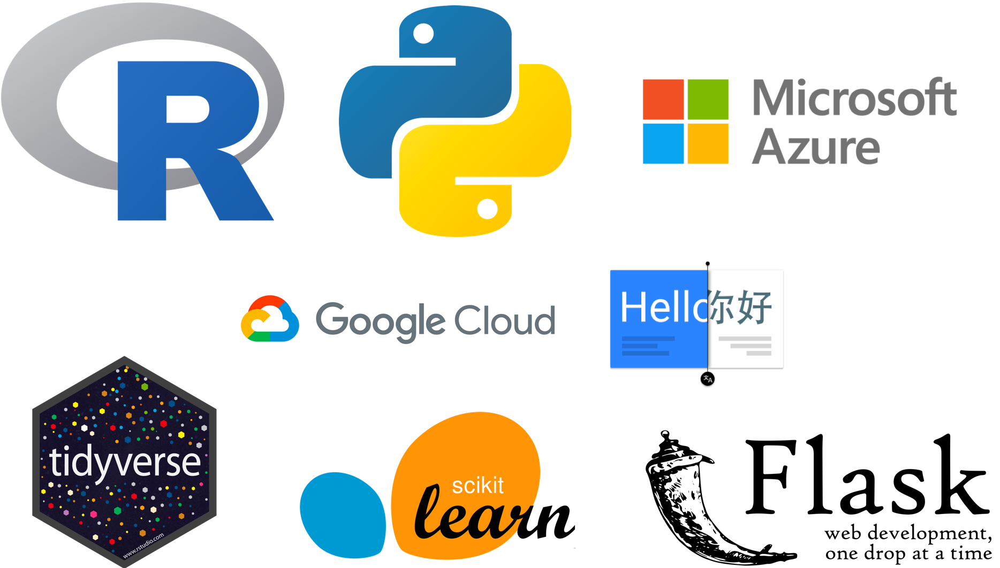

# Predicting Future Sales

## Team
- **Dante Ruiz 183340**, 
- Alejandra Lelo 124433
- Jose Carlos Escobar 175895

## Objective:

To predict the total monthly sales by product and store for [1C]( http://1c.ru/eng/title.html), one of the largest software companies in Russia. The purpose of this predictions is to inform business management strategy, marketing strategies and inventory management.

## Data:

The dataset  belongs [“How to win a data science competition”](https://www.kaggle.com/c/competitive-data-science-predict-future-sales) Kaggle Competition for a Coursera advanced machine learning course.  

## Methodology:

We used the [cross-industry process for data mining (CRISP-DM)](https://www.sv-europe.com/crisp-dm-methodology/) methodology. Thus the project is divided in six sections:

Each section has two deliverable files:

1. **Documentation**. An HTML or Jupyter Notebook file (.ipynb) to document the process and results of each step of the CRISP-DM. *Includes documented code*.
2. **Code**. An R-Markdown (.Rmd) or a Jupyter Notebook file (.ipynb) containing the code to reproduce each step of the project.

## Tools used:

* **Shell scripting**: to download files from the Kaggle API
* **R**: to preprocess, clean and explore data
* **Google Could Translation API**: to translate text from Russian to English
* **Python**: to train and evaluate machine learning models using scikit-learn package.
* **Flask**: to deploy the final model to make monthly sales predictions by product and store.
* **Azure**: to use a Data Science Machine to conduct the entire process

## Deliverables

**Files:** 

1. **Executive summary**: An executive summary of the project in spanish
2. **Comprension_Datos.html**: Web page that describes the dataset 
3. **Traduccion.html** : Web page that describes the text translation from Russian to English 
4. **Entendiendo_el_Negocio** : Web page that describes the business problem 
5. **EDA.html**: Web page that presents the exploratory data analysis
6. **Preparacion_Datos.html**: Web page that describes data cleaning and feature engineering.
7. **Modelado.ipynb**: Web page that presents the machine learning process to fit models. 
8. **Evaluacion.ipynb** : Web page that describes how models were evaluated, the best model selected and how predictions were performed.
Reproducible code:
9. **README.md**: Contains information of how to make the project reproducible.
10. **DescargaDatos.sh** : Shell script to download and extract data
11. **Comprension_Datos.Rmd**
12. **Traduccion.Rmd**
13. **Entendiendo_el_Negocio.Rmd**
14. **EDA.Rmd
15. **Preparacion_Datos.Rmd**
17. **01_Libraries.R**: R script with all the library packages necessary to install to run this project.
18. **02_Utils.R**: R script with auxiliary functions written for this project.
App
19. **predictor.py**: web service application in flask to predict monthly sales by product and store for the month of November 2015.

**Directories:**

* **Datos**: Contains raw datasets.
* **Datos_trad**: Stores translated data in english
* **Datos_clean**: Stores clean datasets
* **Data_Modelos**: Stores the training and testing datasets
* **Modelo_Final**: Stores the final model
* **Flask**: Stores the web service application

## Instructions to reproduce data science project

Follow the steps to reproduce the project and generate the deliverables enlisted above. The code is organized in the CRISP-DM stages. First of all clone the repository.

**I. Understanding the Business**

1. Knit in R-Studio **Entendiendo_el_Negocio.Rmd** to run the understanding the business analysis.

**II. Data Understanding**

1. Run the shell script **DescargaDatos.sh** to download datasets from Kaggle. A Kaggle API Key is needed. Also, the file directory for this project will be created.

2. Run **Descompresion.sh** to decompress R and Python scripts from  “.7z” files using p7zip (Min_FINAL.7z.001 to Min_FINAL.7z.009). The R objects were included if the user wants to save time in code execution. Also translated datasets were included in case the user does not want to reproduce the text translation from Russian to Spanish.

3. Knit in R-Studio de **Traduccion.Rmd** to translate the raw dataset from Russian to English using the Google Cloud Translation API. An API key is needed to execute the translation. This step is optional as translated datasets have been included in **train_trad.rds** within **Datos_trad** file directory

4. Knit in R-Studio **Comprension_Datos.Rmd** to run the understanding the data analysis.

**III. Data Preparation** 

1. Knit in R-Studio **Preparacion_Datos.Rmd** to run the data preparation steps. Note: A computed machine with at least 20 GB in RAM is required to generate this report. In this step we used a Data Science Virtual Machine in Azure.
2. Knit in R-Studio **EDA.Rmd** to run the exploratory data analysis.

**IV. Modelling**

1. Run **Modelado.ipynb** to execute the modelling section that trains the machine learning models. This part also generates the testing set.

**V. Evaluation**

1. Run **Modelado.ipynb** to execute the model evaluation and fine tuning. The best model is saved in a pickle file. A file with the Kaggle predictions is generated.

**VI. Deployment**

1. Run **predictor.py** to execute the flask application to generate predictions by product and store. The same features used in the training and testing set have to be generated and send to the app.
